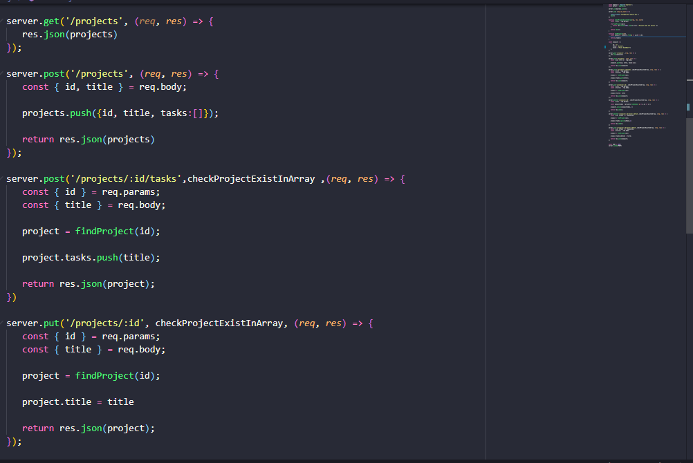
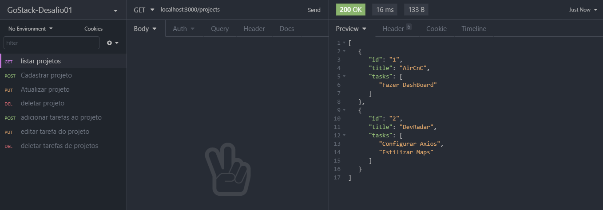

<h1 align="center">
<br>

<br>
Resolução do Desafio 01 do GoStack 🚀
</h1>

<h2 align="center">Codigo</h2>
<h3 align="center"></h3>
<br/>
<h2 align="center">Insomnia</h2>
<h3 align="center"></h3>
<br/>

Resolução do desafio proposto pela <a href='https://rocketseat.com.br' target="_blank">RocketSeat</a>

A explicação de como tinha que ser o desafio está <a href='https://github.com/Rocketseat/bootcamp-gostack-desafio-01/blob/master/README.md#desafio-01-conceitos-do-nodejs' target="_blank">aqui</a>

Coloquei algumas funções extras, para ser possível editar e excluir as tarefas de um projeto.

Para testar as requisições você pode utilizar Insomnia ou postman, caso utilize o insomnia 
estou disponibilizando um arquivo JSON que você poder importar e ele já cria as requisições.

## Instalação
```sh
git clone https://github.com/rafaelsouz/gostack10-desafio01
yarn
# ou
npm install
```
